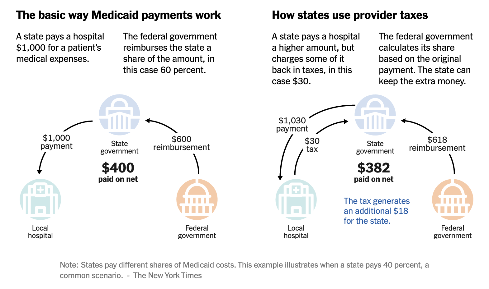

# Econ 281: Research Ideas  
**Regina Calles**
---

## Idea 7

Auclert, Rognlie & Straub (2020) demonstrate that in a HANK framework an interest‑rate cut boosts output mainly through investment, raising labor demand and nominal wages.  
In a developing economy, these wage gains can raise the opportunity cost of schooling and increase upper‑secondary dropout.  
My idea is to estimate the elasticity of upper secondary dropout with respect to a wage increase caused by an interest-rate cut. Treating this elasticity as a proxy for changes in human‑capital investment. The idea is that higher wages should raise the opportunity cost of schooling; the resulting change in dropout rates reveals how monetary policy can indirectly shape the economy’s future human‑capital stock.

### Empirical specification

Δ ln(DropoutShare₍ᵣₜ₎) = αᵣ + δₜ + β (MPShockₜ × IndustryShareᵣ) + X₍ᵣₜ₎ γ + ε₍ᵣₜ₎

where
 
* IndustryShareᵣ =  pre‑shock share of regional employment in youth‑intensive industries (e.g., construction, manufacturing, retail) in region r.
* Region and year fixed effects αᵣ + δₜ

The interaction term provides exogenous wage variation: regions with high employment shares experience larger wage responses to monetary surprises.  
Identification assumes this interaction affects dropout only through wages; which I could test by looking at cohorts that's didn't have a monetary shock during upper secondary years.

Next steps:

1. Granular employment and school data I can get it from employment surveys that are standard in developing countries (their equivalent of CPS)
2. Information about monetary shocks, I don't know, but I could investigate more about this.
---
## Idea 8

In a developing‑country context, large segments of the population lack access to formal credit and therefore have no credit histories, leaving banks unable to assess their default risk. 

To buffer this uncertainty, lenders set very high, risk‑padded interest rates for most applicants while reserving preferential terms for the minority with well‑documented repayment records. It is reasonable to expect that this small subset of borrowers is offered rates much more closely aligned with the central‑bank policy rate.

I propose to study how an interest‑rate cut propagates in a setting of heterogeneous agents and lending rates heavily distorted by default risk uncertainty: cheaper central‑bank funding lowers borrowing costs almost exclusively for high‑income, well‑scored households, while lower‑income borrowers continue to face steep rates.

In other words, I aim to estimate the differential elasticity of loan rates to a monetary policy shock for borrowers with different credit histories, comparing those with verifiable credit histories to those without.

By measuring the differential pass‑through of monetary shocks to loan rates and consumption across income groups, the idea is to show how limited credit access can make expansionary monetary policy widen, rather than reduce, income inequality.

The problem where I'm stuck right now is that I don't know if the data to study this exists/ or if I could have access to it.
I would need:
*data for credit history (maybe I could have access through Banxico)
*data on loan rates: there is a lot of data in the National Banking and Securities Commission of Mexico, for instance: Here I could see the weighted rate for state and institution. the https://app.powerbi.com/view?r=eyJrIjoiM2FiNThiNDUtMzI3Mi00NzNlLTliMWYtNjM1NjhlM2Q4YmJkIiwidCI6IjVlMmM0OTc3LTEwN2QtNDBhMy04YWY3LTcwMDc0ODFhNjBkNCIsImMiOjR9

---

## Idea 6

Workers and firms often invest in training, but returns to those investments depend on whether the market can recognize them. In many developing countries, a large share of skills comes from informal or uncertified training (unobservable quality, e.g., self-employed). If employers cannot verify the quality of that human capital, returns to investments in human capital could be suppressed.

I want to measure the differential return to human capital investments, depending on how observable or verifiable the investment is to potential employers. In other words, I want to estimate the elasticity of wages or employment transition to skill acquisition, as a function of whether the investment is certified or uncertified.

Data:

Labor force surveys with modules on training or education investments: e.g., ENOE (Mexico)
Identify training episodes and classify:

-Formal/certified (degrees, recognized programs)

-Informal/unobservable (on-the-job training, family business)

-Track wage changes or employment upgrades after training. (This is panel data up to 5 quarters)

Empirical Strategy:

Use the rotating panel structure of the ENOE (or a similar labor force survey) to  identify individuals who report receiving training at some point during the panel window, and compare their wage evolution before and after the training.
 
This design allows me to  exploit within-individual variation  and control for time-invariant individual traits through fixed effects.

Then I could think about the macro implications:

If labor markets discount unobservable skill, workers who improve their productivity informally may:

-Remain stuck in low-return occupations

-Fail to transition to higher-productivity sectors or firms

---

## Idea 5

Possible extension of your paper: Asymmetric Information in Capital Markets and the Collateral Channel of Credit Access

Bierdel et al. (2025) show that asymmetric information in capital markets, where sellers know more about the quality of assets than buyers, generates lower capital stock, a higher unemployment rate of capital, and a lower average quality of employed capital. 

This idea explores another implication of asymmetric information: 

If lenders also face this asymmetric information in capital markets, then capital used as collateral is undervalued, and credit supply becomes distorted. The core hypothesis is that capital is a less effective form of collateral when there is asymmetric information in capital markets.

In other words, the object of interest would be the elasticity of credit access to firm capital stock, as a function of the degree of asymmetric information in  capital markets.

Right now, I can only see this as a model because I don't know about this dataset type. But I wanted to share this with you in case you think it could be interesting!

      

---

## Idea 4

In increasingly digitized economies, individuals differ not only in what prices they observe, but also in how they access and use money. This project asks whether people who rely primarily on digital payments form inflation expectations differently than those who transact mostly in cash. The central idea is that the payment method itself may shape exposure to price information, perceived liquidity constraints, or beliefs about monetary stability.

I want to measure the elasticity of average regional inflation expectations to recent local inflation, as a function of the share of transactions in the region that are conducted digitally.  

### Identification

ExpInfl_rt = α_r + δ_t + β1 * π_local_rt + β2 * (π_local_rt × DigitalShare_r) + γ * Z_rt + ε_rt

- **LHS variable**: `ExpInfl_rt` – Average inflation expectations in region *r* at time *t*  
- **RHS variables**:  
  - `π_local_rt` – Realized local inflation in region *r* at time *t*   
  - `DigitalShare_r` – Share of transactions in region *r* that are digital (e.g., card, mobile, or online payments)  
  - `π_local_rt × DigitalShare_r` – Interaction term identifying heterogeneity in responsiveness  
  - `Z_rt` – Region-level controls (e.g., income, education, internet access, unemployment rate)  
- Fixed effects:  
  - `α_r`: Region fixed effects  
  - `δ_t`: Time fixed effects
 

  

### Threats to Identification

1. **DigitalShare_r may proxy for unobserved factors** like  urbanization  
3. **Reverse causality**, if inflation shocks change payment behavior (e.g., shift to cash)

I think the threats are important, and right now I cannot think about a good identification of how to deal with them. I initially thought about this idea, thinking about the recent Iberian Blackout as a Natural Experiment on Digital Payment Disruptions... But I think that affected so many things that I don't think it's the right variation to use.

### Juan's thoughts.

Keep thinking about it. What data would you use? I agree that large shocks have the potential of having violations of exclusion restritions, but maybe you can start running reduce forms if you find an interesting setting.

---

## Idea 3 
 

 I want to estimate the **elasticity of regional inflation expectations to recent local inflation**, as a function of **regional cultural characteristics** measured using survey data such as the World Values Survey.
 
  Specifically, I focus on how regional differences in attitudes — such as trust in government — shape how strongly local inflation feeds into expectations.
 
 

### Motivation

To my knowledge, no paper talks about how regional cultural characteristics affect the responsiveness of **aggregate expectations** to local inflation.  

### Regression Specification

ExpInfl_rt =   δ_t + β1 * π_local_rt + β2 * (π_local_rt × CultureIndex_r) + γ * Z_rt + ε_rt

- **LHS variable**: `ExpInfl_rt` – Average 12-month-ahead inflation expectations in region *r* at time *t*  
- **RHS variables**:
  - `π_local_rt` – Realized local inflation in region *r* at time *t* (e.g., trailing 3-month CPI)  
  - `CultureIndex_r` – Time-invariant index of cultural attitudes in region *r* (e.g., average trust in government, thrift, belief in agency)  
  - `Z_rt` – Regional controls (e.g.,  average income, internet access)  
-  `δ_t`:  time fixed effects

 

### Interpretation

- `β1`: Baseline elasticity of regional expectations to inflation  
- `β2`: Differential elasticity in regions with stronger or weaker cultural indicators (e.g., low trust, high fatalism)

 

### Identifying Assumptions

- `CultureIndex_r` is **pre-determined and time-invariant**, capturing long-run regional beliefs  
- Local inflation shocks (`π_local_rt`) are exogenous to short-run belief formation, conditional on controls  
- No omitted regional trends are correlated with both culture and inflation responsiveness

 
### Threats to Identification

1. **Cultural sorting** — regions with certain cultural profiles may induce migration, and I don't know how to deal with that
2. **Measurement error** — cultural indices based on survey averages may be noisy, especially in small regions   
 
### Actionable Tasks

- Construct `π_local_rt`: Use regional CPI data   to compute recent inflation by region  
- Construct `ExpInfl_rt`: Use consumer survey data with regional identifiers   to calculate average expected inflation  
- Build `CultureIndex_r`: Aggregate regional cultural indicators using the World Values Survey or similar sources. Include:
  - Trust in government  
  - Belief in effort vs. luck  
  - Importance of thrift  
  - Political interest  
  - Religiosity  
- Merge into a panel dataset and estimate the regression above   
 
 ### Juan's thoughts.

 Take a look at the work by Ulrike Malmendier, who instead of using differences across regions, uses differences across cohorts in their exposure to shocks during their lifetimes. Maybe you find interesting ideas there. With cross-country comparisons, the issue will always be that perhaps countries where citizens don't trust the government are also countries where monetary policy is conducted differently (and perhaps irresponsibly).

---

## Idea 1

### Research Question  
**Does the strategic overstatement of state spending to draw down additional federal transfers alter the local, cross-sectional government-spending multiplier?**

### Motivation  
A couple of days ago, I read this in the NY Times:  
**[G.O.P. Targets a Medicaid Loophole Used by 49 States to Grab Federal Money](https://www.nytimes.com/2025/05/06/upshot/medicaid-hospitals-republicans-cuts.html)**

The article explains how nearly every U.S. state uses a Medicaid financing tactic known as a **provider tax**, where hospitals are taxed by the state and then reimbursed at higher rates for treating Medicaid patients.

This setup allows states to inflate reported Medicaid spending, which boosts the amount of federal matching funds they receive—without increasing actual state fiscal effort. The federal government bases its match on gross spending, not net state contributions, so states effectively extract more federal money by looping funds through providers.

According to the article, provider taxes now underwrite approximately one-third of federal Medicaid transfers in several states. Since states can increase federal contributions without raising real state expenditures, estimates of regional fiscal multipliers—assuming local effort behind observed spending—may be upwardly biased.

### How to Answer  
I thought that this could be an interesting application of **Nakamura and Steinsson’s framework**. They distinguish between federally and locally financed spending.

The Medicaid provider-tax mechanism mimics a shift from state-financed to federally financed spending by using recycled provider taxes to unlock higher federal matches, without increasing real state fiscal effort.

However, to accurately model this case, one would need to go beyond simply changing the funding source and explicitly capture the strategic manipulation of the financing structure. That is, the spending increase is largely accounting-based, not cash-based.

Incorporating this type of substitution—where gross reported spending rises but net fiscal effort stays flat—could help reveal how the composition of financing affects local output responses, not just its origin. I’m not yet sure how this could be formally included.

### Juan's thoughts. 
I think this is potentially good. Think about what these scheme is doing. Is it keeping G constant and changing the funding source? Is it relaxing a constraint of the local government so that the state/municipality can increase G further? I only think you need to model explicitly the financing structure if you think that is endogenous. What can you do quickly empirically to check if you have variation to use?

---

## Idea 2

### Research Question  
**How does the size of the informal sector affect the estimated local fiscal multiplier?**

### Motivation  
In the papers that we read for class, there is a common assumption that people pay taxes. But in many developing countries, a large share of employment and output is informal—untaxed, and often outside the reach of state policy. This raises a key concern: does public spending generate the same economic response when much of the local economy is disconnected from the formal fiscal channel? If informality weakens tax feedback, dampens labor mobility, or reduces spending visibility, then traditional estimates may misrepresent the true impact of fiscal stimulus in these settings.

### How to Do It  
Leverage **locality variation** in informality—measured from labor‑force surveys in Mexico—and pair it with plausibly exogenous fiscal shocks to estimate heterogeneous multipliers.

A potential source of exogenous spending is Mexico's *cash transfers to adults 65+ (since 2019)*: eligibility is age‑based and thus potentially orthogonal to local informality rates.

Combine share of 65+ population per locality with municipality‑level informality shares to estimate the multiplier following the cross‑sectional approach of Nakamura & Steinsson (2014). Mechanism to explore: weaker fiscal feedback because informal workers do not pay income or payroll taxes.

### Contribution Relative to Existing Literature

- **From cross‐country to within‐country causality.**  
  Colombo et al. (2024) show lower multipliers in high‑informality countries using forecast‑error identification at the national level. I would like to exploit *within‑country* variation, to hold national institutions, exchange‑rate regime, and other important elements constant.

- **Cleaner identification.**  
  Age‑based cash‑transfer rollouts provide a locality-level shock potentially unrelated to informality and economic conditions (I'm thinking that this share of old population was affected by previous conditions but not current).

- **Micro mechanisms.**  
  Household survey data allow us to decompose spending responses, labor shifts, and formal sector, shedding light on the channels Colombo et al. can only infer from aggregate data.

### Juan's thoughts.

A couple of comments. First, conceptually transfer multipliers are different than expenditure multipliers. This does not invalidate your idea, but think about why. I was not entirely clear on why you think informality is so important. Even when everybody pays taxes, if the Federal Mexican government is paying for the transfers to a local region, from the perspective of the region receiving this transfer this is a windfall. Am I missing something you had in mind? This seems an interesting source of variation to look at, though. Maybe give it another pass and clarify.

---
